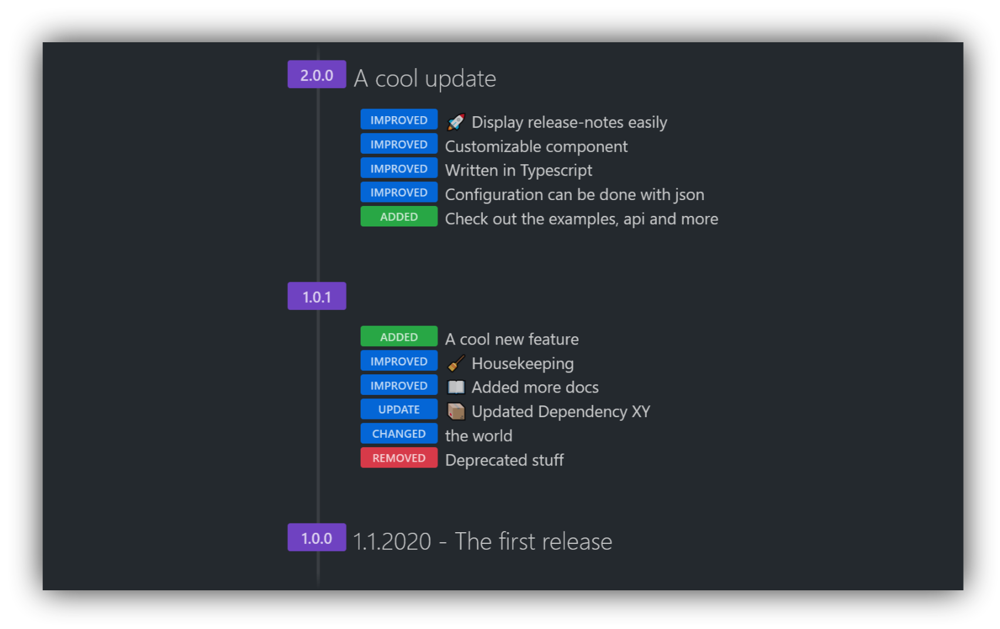

⚠ The project is in an experimental stage and not stable ⚠

# [&lt;release-notes-displayer>](https://litetex.github.io/release-notes-displayer) 

A webcomponent which displays release notes

Inspired by [GitHub desktop's release notes](https://desktop.github.com/release-notes/)

### Installing / Usage 

Install it using ``npm i @litetex/release-notes-displayer``

Also checkout the online [documentation](https://litetex.github.io/release-notes-displayer) for more information.

#### Installing the development version 
Install it using ``npm i @litetex/release-notes-displayer@dev``

### [Developing](Developing.md)
### [Building](Building.md) 
